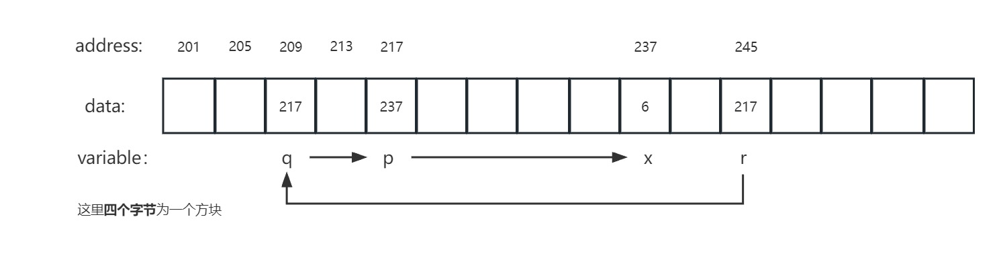
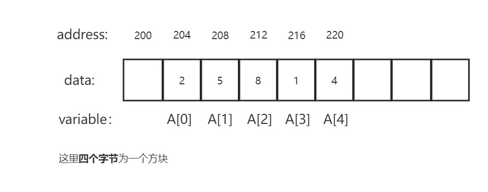
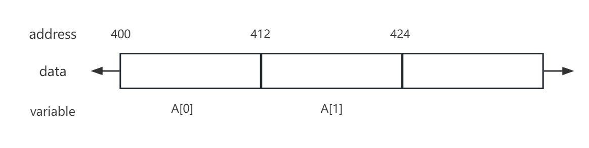
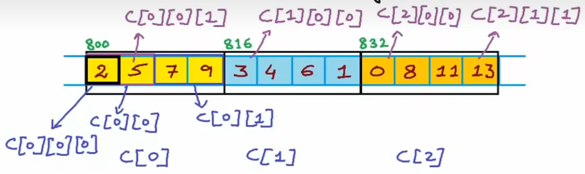
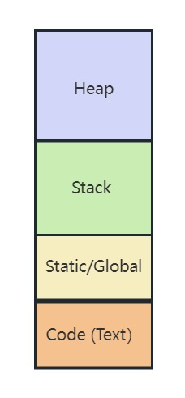
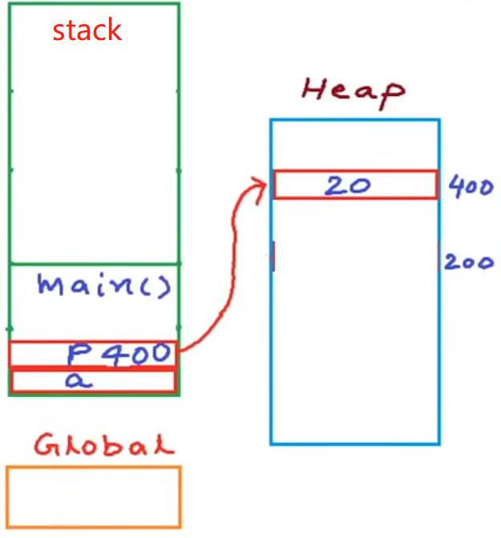
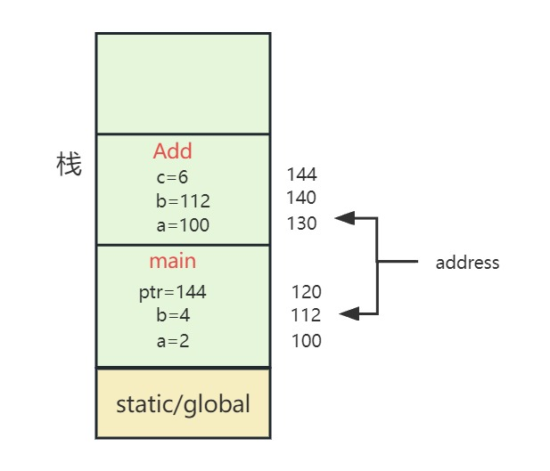
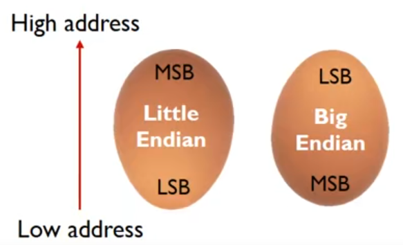

# 指针

学习视频见：[Harsha讲指针](https://www.bilibili.com/video/BV1bo4y1Z7xf/?spm_id_from=333.337.search-card.all.click&vd_source=cb747e9ce5eec653e35e42849c7a811b)

```c
int a = 5;      //声明变量,假设a的地址是204

int *p;         //声明指针变量，  假设p的地址是64
*p = &a;        //令p指针指向a
//等价于 int *p = &a; 

/*结果
p = &a = 204
&p = 64
*/
```

注意：

- **指针是强类型的**， `int *p `表示声明指针变量，且该指针指向的数据的类型为 `int`
- 在不是声明指针的情况下，`*P`为解引用操作，取出p指向的地址的值
- `sizeof(p) =  8`， 32位平台所有类型的指针的占用空间大小都是4个字节，**64位平台所有类型的指针占用的空间大小为8个字节**，而 `sizeof(*P) = 4`，也就是指向地址存储的**数据类型大小**

---

```c
printf("%d\n", p);
printf("%d\n", p+1);	//得到下一个整形数据的地址，因此会+4

/*结果
204
208
*/
```

<br>

---

# 指向指针的指针

```c
int main()
{
    int x = 5;
    int *p = &x;
    *p = 6;

    int **q = &p;
    int ***r = &q;

    printf("%d\n", *p);     // 6
    printf("%d\n", *q);     // 237
    printf("%d\n", **q);    // 6
    printf("%d\n", *r);     // 217
    printf("%d\n", **r);    // 237
    printf("%d\n", ***r);   // 6

    ***r = 10;
    printf("%d\n", x);      // 10
    **q = *p + 2;           // x = x + 2
    printf("%d\n", x);      // 10
  
  	return 0;
}
```



<br>

---

# 数组与指针

```c
int main()
{
    int A[5] = {2, 5, 8, 1, 4};
    int *p = A;	            // 等价于 int *p = &A[0]

    printf("%d\n", p);      // 204
    printf("%d\n", *p);     // 2

    printf("%d\n", p+1);    // 208
    printf("%d\n", *(p+1)); // 5

    return 0;
}

```



注意：

- 数组作为函数参数，只有传引用，没有传值方式，函数声明中 `int arr[]` 等价于 `int *arr`， **且是拷贝数组首地址**
- 数组取地址的两种方式： `&arr[i]` 或 `arr + i`
- 数组取值的两种方式：`arr[i]` 或 `*(arr + i)`
- **与指针的相同点：** `int *p = arr`, 那么上述方式中 `p` 可以替换 `arr`
- **与指针的不同点：** 若arr是一个数组，则不能像指针变量那样对它进行增加或减小， 即不能 `arr++`

<br>

---

## 字符指针

```c
char arr1[20] = "hello";		// 字符串被分配在这个数组的内存空间中(栈上)
char *p = "john";			// 字符串被分配在常量区(代码区)
printf("%c\n", *p);
printf("%s\n", arr1);
printf("%s\n", p);

/*结果
j
hello
john
*/
```

- `arr1`中的内容可修改， `arr2`中的内容不可修改
- `p`实际上存放字符串常量的首地址
- `%s` 遇到 `\0`就停止打印，从**指向首地址的指针**（`arr`和 `p`） 开始打印出来整个字符串
- 字符指针的标准写法，需要给字符指针前面加上 `const`
- 在函数中标识只允许读，不允许写，可以写成 `void function(const char *str)`, 即在字符指针前加 `const`，此时不可修改指针指向的值
- **`strlen(str)`**：如果要获得这个字符串的长度，则一定要用 `strlen`。

<br>

---

# 指针和二维数组

```c
int A[2][3] = {1, 2, 3, 4, 5, 6};
int (*p)[3] = A;        // p是指向A[0][0]的指针， p = 400
int (*q)[3] = p + 1;    // q是指向A[1][0]的指针， q = 412
```



注意：

- 实际上是在创建数组的数组，即创建了两个一维数组 `A[0]` 和 A `[1]`，每个一维数组包含三个整形元素
- 现在 `int *p = A`将编译报错，因为A返回的是一个指向一维数组的指针
- **正确写法**:`int (*P)[3] = A`, 表面这是一个指向数组的指针，即数组指针， 数组的元素为3

```c
print A  or  &A[0]                      // 400, 这里 A+1 会12个字节的加 
print *A  or  A[0]  or  &A[0][0]        // 400, 这里*A + 1 会4个字节的加
  
print A+1  or  &A[1]                    // 412
print *(A+1)  or  A[1]  or  &A[1][0]	// 412
```

$\because$ `&A[0] `和 `&A[0][0]`指向的是同一地址，又数组名 `A[0]` 代表地址， 所以造成 `A` 和 `*A` 指的是同一地址,  `A+1`同理

```c
问题：
*(A+1) + 2 等于多少？
  
420
```

<br>

---

# 指针和多维素组

```c
int C[3][2][2] = {{2, 5, 7, 9}, {3, 4, 6, 1}, {0, 8, 11, 13}};
int (*p)[2][2] = C;

/*****一些例子，想想为什么*****/
C[i]j][k] = *(C[i][j] + k) = *(*(C[i] + j) + k) = *(*(*(C+i) + j) + k)
*(C[0][1] + 1) = 9
*(C[1] + 1) = 824
```



<br>

# 函数和多维数组

```c
#include <stdio.h>

void Func1(int *p);             // 等价于 void Func1(int p[])
  
void Func2(int (*P)[3]);        // 等价于 void Func2(int p[][3])

void Func3(int (*p)[2][2])      //等价于 void Func3(int p[][2][2])
int main()
{
  int A[2] = {1, 2};
  int B[2][3] = {{2, 4, 6}, {5, 7, 8}};
  int C[3][2][2] = {{{2, 5}, {7, 9}},
                    {{3, 4}, {6, 1}},
                    {{0, 8},{11, 13}}};
	Func1(A);
  Func2(B);
  Func3(C);
}

```

注意：

- 传入的数组指针后面的维度需要匹配， 如 `Func2`中， 需要传入二维数组的最后维度必须是3
- 传入多维数组时，函数参数不能表示为 `**p`, 或者 `***p`， 即 `void(int **p)` 是错误的

<br>

# 动态内存：堆栈

## 程序的内存分配

- 一个程序的动态内存由**代码区**，**静态/全局变量区**，**栈**，**堆**组成，**只有堆的大小不是固定的**。



---

## 栈

```c
# include <stdio.h>

int total;  // global

int Square(int x)   //函数，x栈区
{
    return x * x;
}

int SquareOfSum(int x, int y)   //函数，x, y, z 栈区
{
    int z = Square(x + y);
    return z;
}

int main()  //栈
{
    int a = 4, b = 8;   // 栈
    total = SquareOfSum(a, b);  // 栈
    printf("output = %d\n", total);		//栈

    return 0;
}
```

- 内存给栈的空间是固定的， 系统为程序起初分配了一些预留内存，超出栈区会导致栈溢出 `stack overflow`，程序崩溃， 如无穷递归。
- **所有的局部变量，参数，函数返回地址**都存在**栈帧**上，一个函数的栈帧大小在编译器件就已经决定好了
- 当函数被调用时，它被压入栈，当它结束时弹出栈区，栈先入后出
- **限制：**如果变量在栈上分配的，那就不能操作变量的范围，例如一个局部变量的数组需要在运行期间根据参数决定大小，那么使用栈就会有问题

<br>

---

## 堆

```c
# include <stdio.h>
# include <stdlib.h>


int main()
{
    int a;      // 栈
    int *p;     // 栈 
    p = (int *)malloc(sizeof(int)); // 堆，p指向堆区的某个地址,假设为200
    *p = 10
    free(p);    //传入地址释放内存，因为堆区的内存不会主动释放
    p = (int *)malloc(sizeof(int)); //堆， p重新指向堆区的某个地址，假设为400
    *p = 20;

    return 0;
}
```



- 堆相关的四个关键字： **`malloc， calloc， realloc， free`**
- 堆被称为**动态内存**，动态内存的分配都是基于指针的，动态分配的内存在程序运行期间不释放，可以通过 `free`释放，释放后的内存才可以被重新分配。
- 堆的空间不固定，程序的生命周期内是可变的

<br>

---

## 深入理解动态内存

**应用场景举例**：[动态内存案例](../pointer/dynamic_example.c)

<br>

```c
void* malloc(size_t, _Size);        //函数原型，参数是内存块字节数大小

p = (int*)malloc(20 * sizeof(int)); //分配一个连续且能够存放20个整型的内存
```

- `size_t` 类型表示C中任何对象所能达到的最大长度，它是无符号整数，等价于 `unsigned int`。因此不能为负数
- 需要对 `malloc`做强制转换，因为无法对 `void*`解引用
- malloc未初始化

---

```c
void* calloc(size_t _NumOfElements, size_t _SizeOfElements);    //函数原型，单元数量，单元数量大小

int* p = (int*)calloc(3, sizeof(int));  //分配连续12字节的内存
```

- calloc已初始化为0

---

```c
//函数原型，第一个参数指向已分配内存的起始地址的指针， 第二个参数是新内存块的大小
void* realloc(void *_Memory, size_t _NewSize)
```

- `realooc`可以扩展原堆上已分配内存的大小，并复制原来指针附近可用的内存数据到新的内存中
- 作扩展时，如果能够在原来的基础上找到连续的内存，那么扩展之前的快；否则开辟新的内存，释放原来的内存
- 作缩减时，则直接释放后面的内存，其余数据不动
- `realloc(p, 0)` 时，则等价于 `free(p)`,  且**地址赋值NULL，即0**
- `realloc(NULL, _NewSize)` 等价于 `malloc`

<br>

---

## 内存泄露

```c
/**
 * 这是一个赌博小游戏，这里有"jack','queen','king'三个角色，
 * 每次下注竞猜queen的位置，猜对获得赌注的三倍奖励，
 * 初始金币为100。
*/
# include <stdio.h>
# include <stdlib.h>
# include <time.h>

void play(int bet);

int cash = 100;

int main()
{
    int bet;
    printf("Welcome to the virtual Casino\n");
    printf("Total cash is $%d\n", cash);
    while (cash > 0)
    {
        printf("What's your bet? $");
        scanf("%d", &bet);
        if (bet == 0 || bet > cash)
            break;
        play(bet);
        printf("\n***************************************\n");
    }
}

void play(int bet)
{
    int i, x, y, temp;
    int playersGuess;

    // char C[3] = {'J', 'Q', 'K'};
    char *C = (char *)malloc(3 * sizeof(char));	    //堆
    C[0] = 'J'; C[1] = 'Q'; C[2] = 'K';

    printf("shuffling...\n");
    srand(time(NULL));          // 设置随机种子生成器
    for (i = 0; i <= 5; i++)
    {
        x = rand() % 3;
        y = rand() % 3;
        temp = C[x];
        C[x] = C[y];
        C[y] = temp;
    }
  
    printf("What's the position of Queen - 1,2 or 3?  ");
    scanf("%d", &playersGuess);
    if (C[playersGuess - 1] == 'Q')
    {
        cash += 3 * bet;
        printf("You Win | Result = \"%c %c %c\" Total Cash=%d\n", C[0], C[1], C[2], cash);
    }
    else
    {
        cash -= bet;
        printf("You Loose | Result = \"%c %c %c\" Total cash=%d\n", C[0], C[1], C[2], cash);
    }
    free(C);    //释放堆上内存
}

```

- 函数在执行结束后会自动回收该函数在栈帧上的内存
- 堆上的内存不会主动释放，**必须显式地用free释放**，因此该小游戏在一直进行下去的时候内存会越来越大，这就是**内存泄漏**。

<br>

---

# 函数返回指针

函数返回指针即**指针函数**。顾名思义，它的本质是一个函数，不过它的返回值是一个指针。其声明的形式如下所示：

```c
ret *func(args, ...);
```

其中，`func`是一个函数，`args`是形参列表，`ret *`作为一个整体，是 `func`函数的返回值。

<br>

```c
# include <stdio.h>
# include <stdlib.h>

void PrintHello() {
    printf("hello world!");
}

int* Add(int *a, int *b) {  
    int c = *a + *b;
    return &c;
}

int main()
{
    int a = 2, b = 4;
    int *ptr = Add(&a, &b);
    PrintHello();
    printf("a + b = %d\n", *ptr);

    return 0;
}
```

- 这段代码有逻辑错误，如下图所示，当Add执行完毕后，栈区相对应的内存销毁，随后 `PrintHello`函数入栈，`ptr`指向的内存地址会被 `PrintHello`函数内存污染。从而指向一个垃圾值。

  <center></center>

**用堆的解决方案：**

```c
int* Add(int *a, int *b) {  
    int *c = (int*)malloc(sizeof(int));   //c指向堆区的地址，假设为500
    *c = *a + *b;
    return c;	                          //返回堆区的地址500
}
```

<br>

---

# 函数指针

与指针函数不同，**函数指针** 的本质是一个指针，该指针的地址指向了一个函数，所以它是指向函数的指针。**函数的定义是存在于代码段**，因此，每个函数在代码段中，也有着自己的入口地址。

**函数指针就是指向代码段中函数入口地址的指针。**其声明形式如下所示：

```c
ret (*p)(args, ...);
```

其中，`ret`为返回值，`*p`作为一个整体，代表的是指向该函数的指针，`args`为形参列表。其中 `p`被称为**函数指针变量** 。

<br>

**举例：**

```c
#include <stdio.h>
#include <stdlib.h>

void PrintHello(char *name)
{
    printf("Hello, %s\n", name);
}
int main()
{
    void (*ptr)(char *);
    ptr = PrintHello;
    ptr("Tom");
  
    return 0;
}
```

<br>

---

## 回调函数

一个函数的引用传给另一个函数时，**被引用函数**称为**回调函数**

```c
# include <stdio.h>

void A()
{
    printf("Hello");
}

void B(void (*ptr)())
{
    ptr();
}
int main()
{
    B(A);

    return 0;
}
```

- A作为回调函数被B引用

<br>

**应用场景举例：重点！**

```c
/**
 * 带有回调函数的冒泡排序，
 * 实现自定义的排序规则：compare or abosulte_compare
*/

# include <stdio.h>
# include <math.h>

/*数值大小排序规则*/
int compare(int a, int b)
{
    if (a > b)
        return -1;
    else
        return 1;
}

/*绝对值大小排序规则*/
int abosulte_compare(int a, int b)
{
    if (abs(a) > abs(b))
        return 1;
    else
        return -1;
}

/*冒泡排序, 需要传入排序规则的回调函数*/
void BubbleSort(int *arr, int n, int (*compare)(int, int))
{
    int i, j;
    for (i = 0; i < n; i++)
    {
        for (j = 0; j < n - 1 - i; j++)
        {
            if(compare(arr[j], arr[j+1]) > 0)
            {
                arr[j] = arr[j] + arr[j + 1];
                arr[j + 1] = arr[j] - arr[j + 1];
                arr[j] = arr[j] - arr[j + 1];
            }
        }
    }
}

int main() 
{
    int arr[8] = {-1, -3, 5, 2, 0, -9, 14, 7};
    int n = sizeof(arr) / sizeof(arr[0]);

    BubbleSort(arr, n, abosulte_compare);

    for (int i = 0; i < n; i++)
    {
        printf("%d ", arr[i]);
    }
    return 0;
}
```

- 回调函数使得可以任意定制排序的规则，而不需要修改冒泡排序函数。类似多态的机制。

<br>

- **局限性**：`BobbleSort`只能接收整型的数组，但我们有一个库函数，可以接收任意的数组。如下：

```c
/**
 * 运用stdlib.h中的quick sort 实现多更多数据类型的排序。
*/
# include <stdio.h>
# include <stdlib.h>


int compare(const void *a, const void *b)
{
    int A = *((int *)a);
    int B = *((int *)b);
    return A - B;
}

int main()
{
    int arr[8] = {-1, -3, 5, 2, 0, -9, 14, 7};
    int n = sizeof(arr) / sizeof(arr[0]);

    qsort(arr, n, sizeof(int), compare);

    for (int i = 0; i < n; i++)
    {
        printf("%d ", arr[i]);
    }
    return 0;
}
```

- `qsort`接收一个任意类型的数组(整型，浮点型，结构体等等)，数组的大小，数组内的数据类型大小， 比较函数的指针。
- 其中 `compare`函数在返回任意正数的时候交换a,b。

<br>

---

# 概念加餐

字节的排列方式有两个通用规则:

- 大端序(`Big-Endian`)将数据的低位字节存放在内存的高位地址，高位字节存放在低位地址。这种排列方式与数据用字节表示时的书写顺序一致，符合人类的阅读习惯。
- 小端序 `(Little-Endian`)，将一个多位数的低位放在较小的地址处，高位放在较大的地址处，则称**小端序**。

<center></center>

计算机电路先处理低位字节，效率比较高，因为计算都是从低位开始的。所以，**计算机的内部处理都是小端字节序。在计算机内部，小端序被广泛应用于现代 CPU 内部存储数据；而在其他场景，比如网络传输和文件存储则使用大端序**。

<br>

```c
*ptr++ 等价于 *(ptr++)
x = *ptr++; 等价于 x = *ptr; ptr++;

x = (*ptr)++; 等价于 x = *ptr; *ptr = *ptr + 1;
```
