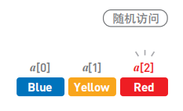
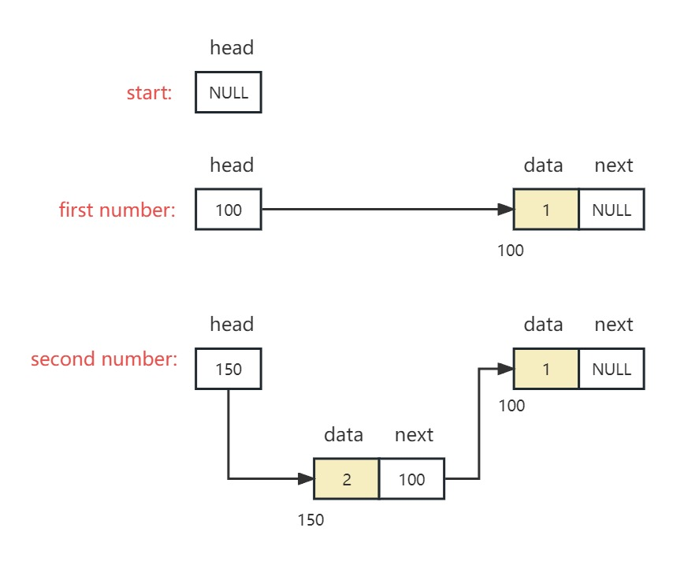
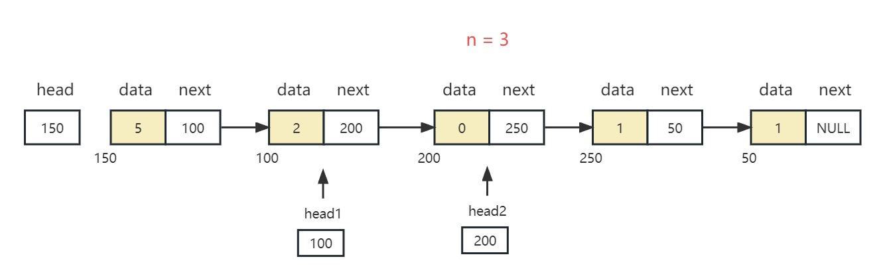
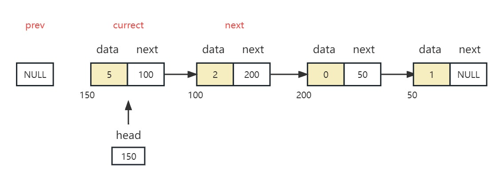
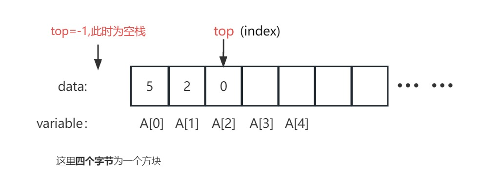
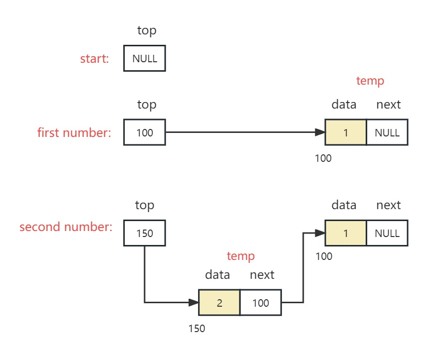

# 抽象数据类型

**`Abstract data types (ADT):`**

- 定义了数据和操作，但没有相关实现

---

# 数组

数组是一种[线性](https://so.csdn.net/so/search?q=线性&spm=1001.2101.3001.7020)结构，而且在物理内存中也占据着一块连续空间。

> - **优点**：访问数据简单。
> - **缺点**：添加和删除数据比较耗时间。
> - **使用场景**：频繁查询，对存储空间要求不大，很少增加和删除的情况。

**数据访问**：由于数据是存储在连续空间内，所以每个数据的内存地址都是通过数据小标算出，所以可以直接访问目标数据。（这叫做“随机访问”）。比如下方，可以直接使用a[2]访问Red。

<div align="center"></div>

**数据添加**：数据添加需要移动其他数据。首先增加足够的空间，然后把已有的数据一个个移开。

<div align="center"></div>

<div align="center"></div>

**数据删除**：反过来，如果想要输出数据Green，也是一样挨个把数据往反方向移动。

<div align="center"></div>

<div align="center"></div>

<br>

---

# 链表

链表是物理存储单元上非连续的、非顺序的存储结构，数据元素的逻辑顺序是通过链表的指针地址实现，每个元素包含两个结点，**一个是存储元素的数据域 (内存空间)，另一个是指向下一个结点地址的指针域。**

> - **优点**：数据添加和删除方便
> - **缺点**：访问比较耗费时间
> - **适用场景**：数据量较小，需要频繁增加，删除操作的场景

数组和链表数据结构对比列表如下：

<div align="center"></div>

**数据访问**：因为数据都是分散存储的，所以想要访问数据，只能从第一个数据开始，顺着指针的指向逐一往下访问，复杂度为`O(n)`。

<div align="center"></div>

**数据添加**：把Green的指针指向Yellow。再把Blue的指针指向的位置变成Green。

<div align="center"></div>


<br>

---

## 单链表

[单链表完整代码示例](../data_structure/1-SingleLinkList.c)

1. **链表头部插入节点**

```c
struct Node
{
    int data;
    struct Node *next;
}

struct Node *head; // global

/*在链表头部插入节点*/
void Insert(int x)
{
    struct Node *temp = (struct Node *)malloc(sizeof(struct Node));
    temp->data = x;
    temp->next = head;
    head = temp;
}
```

<div align="center"></div>


- 当`head`为`mian`函数的**局部变量**时的进阶写法:

```c
/*运用指针的指针在链表头部插入节点*/
void Insert(struct Node **PointerToHead, int x)
{
    struct Node *temp = (struct Node *)malloc(sizeof(struct Node));
    temp->data = x;
    temp->next = *PointerToHead;
    *PointerToHead = temp;
}
```

<br>

2. **链表任意位置插入节点**

	以下默认`typedef struct Node{} Node;`

```c
Node* Insert(Node *head, int data, int n)    // head为局部变量时的写法
{
    Node *temp1 = (Node *)malloc(sizeof(Node));
    temp1->data = data;
    temp1->next = NULL;
    if (n == 1)   // n=1时直接连接head
    {
        temp1->next = head;
        head = temp1;
        return head;
    }
    Node *head1 = head;         // n>2时需要复制表头
    for (int i = 0; i < n - 2; i++) // n>2时移动复制的表头
    {
        head1 = head1->next;
    }
    temp1->next = head1->next;  // n=2时天然成立
    head1->next = temp1;
    return head;
}
```

<br>

3. **链表任意位置删除节点**

```c
Node *head = NULL;	    // global
void Delete(int addr)
{
    Node *head1 = head;
    if (addr == 1)
    {
        head = head1->next;
        free(head1);
        return;
    }
    while (addr-- > 2)  // offset
    {
        head1 = head1->next;
    }

    Node *head2 = head1->next;  // Refactoring links
    head1->next = head2->next;
    free(head2);
}
```

<div align="center"></div>

<br>

4. **反转链表（遍历法 or 递归法）**

```c
/*遍历法反转链表,见图1*/
void Reverse()
{
    Node *currect, *prev, *next;
    currect = head;    // initialize
    prev = NULL;
    while (currect != NULL)
    {
        next = currect->next;    // save the next node
        currect->next = prev;    // point to previous
        prev = currect;          // prepare for the next time
        currect = next;
    }
    head = prev;
}

/*递归法反转链表*/
void Reverse(Node *p)
{
    if (p->next == NULL)
    {
        head = p;
        return;
    }

    Reverse(p->next);
    Node *q = p->next;
    q->next = p;
    p->next = NULL;
}
```

<div align="center"></div>

<div align="center">图1: 遍历法反转链表</div>

<br>

<div align="center"></div>

<div align="center">图2: 递归法反转链表</div>

<br>

5. **递归打印链表**

```c
/*Print Link List*/
void Print(Node *head)
{
    if (head == NULL)
    {
        printf("\n");
        return;
    }
    //Print(head->next);
    printf("%d ", head->data);
    Print(head->next);
}
```

- 如果递归函数在打印后，是正向打印，递归函数在打印前，则是反向打印。
- 递归方法效率会低一些，调用更多的栈区空间

<br>


---

## 双链表

[双链表完整代码示例](../data_structure/1-DoubleLinkList.c)

1. **双链表头部插入节点**

```c
typedef struct Node  // create a double link list.
{
    int data;
    struct Node *next;
    struct Node *prev;
} Node;

Node *head = NULL;    // global

/**************************************************************************************/

/*Create a new node*/
Node* GetNewNode(int x)
{
    Node *newNode = (Node *)malloc(sizeof(Node));
    newNode->data = x;
    newNode->next = NULL;
    newNode->prev = NULL;

    return newNode;
}

/*Insert a node to head*/
void InsertAtHead(int x)
{
    Node *newNode = GetNewNode(x);
    if (head == NULL)
    {
        head = newNode;
        return;
    }
    head->prev = newNode;
    newNode->next = head;
    head = newNode;
}
```

<br>

---

# 栈

栈也是一种数据呈线性排列的数据结构，不过在这种结构中，我们只能访问最新添加的数据。从栈顶放入元素的操作叫入栈，取出元素叫出栈。

> 特点：后进先出（Last In First Out，简称LIFO）

<br>

**空栈:** 不含任何任何数据元素的栈称为空栈

**栈顶（top)**: 我们把允许插入和删除的一端称为 栈顶

**入栈(push)；出栈(pop)**

<br>

---

## **顺序栈**

- 可以使用**线性表**的顺序存储结构（即数组）实现栈，将之称之为 **顺序栈**

- 顺序栈需要事先确定一个固定的长度**（数组长度）**，能存在内存空间浪费问题，但它的优势是存取时定位很方便。
- 顺序栈的时间复杂度为O(1)

**顺序栈的例子：**

```c
# include <stdio.h>
# include <stdlib.h>

#define MAX_SIZE 101

void Push(int x);
void pop();
int Top();
void Print();

int A[MAX_SIZE];
int top = -1;   // At the beginning, it represents an empty stack

int main()
{
    Push(5); Print();
    Push(2); Print();
    Push(0); Print();
    pop();   Print();
    pop();   Print();
    return 0;
}

/*Push operation to insert an element on top of stack. */
void Push(int x)
{
    if (top == MAX_SIZE - 1)
    {
        printf("Error: Stack overflow\n");
        return;
    }
    A[++top] = x;
}

/*Pop operation to remove an element from top of stack.*/
void pop()
{
    if (top == -1)
    {   
        printf("Error: No element to pop\n");
        return;
    }
    top--;
}

/*Top operation to return element at top of stack.*/
int Top()
{
    return A[top];
}

void Print()
{
    int i;
    printf("Stack: ");
    for (i = 0; i <= top; i++)
    {
        printf("%d ", A[i]);
    }
    printf("\n");
}
```

<div align="center"></div>

<div align="center">顺序栈示意图</div>

<br>

---

## 链栈

[链栈完整代码示例](../data_structure/2-LinkStack.c)

- 要求每个元素都要配套一个指向下个结点的指针域增大了内存开销，但好处是栈的长度无限。

	> 因此，如果栈的使用过程中元素变化不可预料，有时很小，有时很大，那么最好使用链栈反之，如果它的变化在可控范围内，则建议使用顺序栈。

- 链栈的时间复杂度为**O(1)**,选择链表头部为栈顶。

```c
Node *top = NULL; //global

void Push(int x)
{
    Node *temp = (Node *)malloc(sizeof(Node));
    temp->data = x;
    temp->next = top;
    top = temp;
}

void Pop()
{
    Node *top1 = top;
    if (top == NULL)
        return;
    top = top->next;
    free(top1);     // Don't forget freeing the memory
}

int Top()
{
    return top->data;
}
```

<div align="center"></div>

<div align="center">链栈图</div>

<br>

---

