# 抽象数据类型

**`Abstract data types (ADT):`**

- 定义了数据和操作，但没有相关实现

---

# 数组

数组是一种[线性](https://so.csdn.net/so/search?q=线性&spm=1001.2101.3001.7020)结构，而且在物理内存中也占据着一块连续空间。

> - **优点**：访问数据简单。
> - **缺点**：添加和删除数据比较耗时间。
> - **使用场景**：频繁查询，对存储空间要求不大，很少增加和删除的情况。

**数据访问**：由于数据是存储在连续空间内，所以每个数据的内存地址都是通过数据小标算出，所以可以直接访问目标数据。（这叫做“随机访问”）。比如下方，可以直接使用a[2]访问Red。

<div align="center"></div>

**数据添加**：数据添加需要移动其他数据。首先增加足够的空间，然后把已有的数据一个个移开。

<div align="center">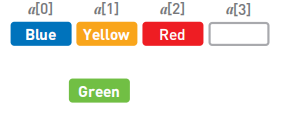</div>

<div align="center">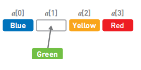</div>

**数据删除**：反过来，如果想要输出数据Green，也是一样挨个把数据往反方向移动。

<div align="center">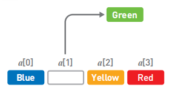</div>

<div align="center"></div>

<br>

---

# 链表

链表是物理存储单元上非连续的、非顺序的存储结构，数据元素的逻辑顺序是通过链表的指针地址实现，每个元素包含两个结点，**一个是存储元素的数据域 (内存空间)，另一个是指向下一个结点地址的指针域。**

> - **优点**：数据添加和删除方便
> - **缺点**：访问比较耗费时间
> - **适用场景**：数据量较小，需要频繁增加，删除操作的场景

数组和链表数据结构对比列表如下：

<div align="center">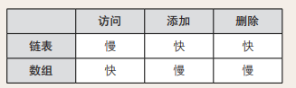</div>

**数据访问**：因为数据都是分散存储的，所以想要访问数据，只能从第一个数据开始，顺着指针的指向逐一往下访问，复杂度为`O(n)`。

<div align="center">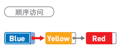</div>

**数据添加**：把Green的指针指向Yellow。再把Blue的指针指向的位置变成Green。

<div align="center"></div>


<br>

---

## 单链表

[单链表完整代码示例](../data_structure/1-SingleLinkList.c)

1. **链表头部插入节点**

```c
struct Node
{
    int data;
    struct Node *next;
}

struct Node *head; // global

/*在链表头部插入节点*/
void Insert(int x)
{
    struct Node *temp = (struct Node *)malloc(sizeof(struct Node));
    temp->data = x;
    temp->next = head;
    head = temp;
}
```

<div align="center"></div>


- 当`head`为`mian`函数的**局部变量**时的进阶写法:

```c
/*运用指针的指针在链表头部插入节点*/
void Insert(struct Node **PointerToHead, int x)
{
    struct Node *temp = (struct Node *)malloc(sizeof(struct Node));
    temp->data = x;
    temp->next = *PointerToHead;
    *PointerToHead = temp;
}
```

<br>

2. **链表任意位置插入节点**

	以下默认`typedef struct Node{} Node;`

```c
Node* Insert(Node *head, int data, int n)    // head为局部变量时的写法
{
    Node *temp1 = (Node *)malloc(sizeof(Node));
    temp1->data = data;
    temp1->next = NULL;
    if (n == 1)   // n=1时直接连接head
    {
        temp1->next = head;
        head = temp1;
        return head;
    }
    Node *head1 = head;         // n>2时需要复制表头
    for (int i = 0; i < n - 2; i++) // n>2时移动复制的表头
    {
        head1 = head1->next;
    }
    temp1->next = head1->next;  // n=2时天然成立
    head1->next = temp1;
    return head;
}
```

<br>

3. **链表任意位置删除节点**

```c
Node *head = NULL;	    // global
void Delete(int addr)
{
    Node *head1 = head;
    if (addr == 1)
    {
        head = head1->next;
        free(head1);
        return;
    }
    while (addr-- > 2)  // offset
    {
        head1 = head1->next;
    }

    Node *head2 = head1->next;  // Refactoring links
    head1->next = head2->next;
    free(head2);
}
```

<div align="center"></div>

<br>

4. **反转链表（遍历法 or 递归法）**

```c
/*遍历法反转链表,见图1*/
void Reverse()
{
    Node *currect, *prev, *next;
    currect = head;    // initialize
    prev = NULL;
    while (currect != NULL)
    {
        next = currect->next;    // save the next node
        currect->next = prev;    // point to previous
        prev = currect;          // prepare for the next time
        currect = next;
    }
    head = prev;
}

/*递归法反转链表, 递归是隐式的栈*/
void Reverse(Node *p)
{
    if (p->next == NULL)
    {
        head = p;
        return;
    }

    Reverse(p->next);
    Node *q = p->next;
    q->next = p;
    p->next = NULL;
}
```

<div align="center"></div>

<div align="center">图1: 遍历法反转链表</div>

<br>

<div align="center">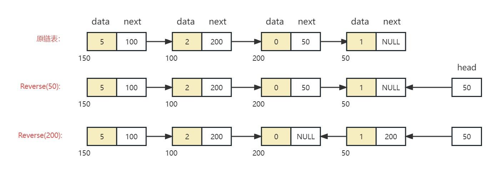</div>

<div align="center">图2: 递归法反转链表</div>

<br>

5. **递归打印链表**

```c
/*Print Link List*/
void Print(Node *head)
{
    if (head == NULL)
    {
        printf("\n");
        return;
    }
    //Print(head->next);
    printf("%d ", head->data);
    Print(head->next);
}
```

- 如果递归函数在打印后，是正向打印，递归函数在打印前，则是反向打印。
- 递归方法效率会低一些，调用更多的栈区空间

<br>


---

## 双链表

[双链表完整代码示例](../data_structure/1-DoubleLinkList.c)

1. **双链表头部插入节点**

```c
typedef struct Node  // create a double link list.
{
    int data;
    struct Node *next;
    struct Node *prev;
} Node;

Node *head = NULL;    // global

/**************************************************************************************/

/*Create a new node*/
Node* GetNewNode(int x)
{
    Node *newNode = (Node *)malloc(sizeof(Node));
    newNode->data = x;
    newNode->next = NULL;
    newNode->prev = NULL;

    return newNode;
}

/*Insert a node to head*/
void InsertAtHead(int x)
{
    Node *newNode = GetNewNode(x);
    if (head == NULL)
    {
        head = newNode;
        return;
    }
    head->prev = newNode;
    newNode->next = head;
    head = newNode;
}
```

<br>

---

# 栈

栈也是一种数据呈线性排列的数据结构，不过在这种结构中，我们只能访问最新添加的数据。从栈顶放入元素的操作叫入栈，取出元素叫出栈。

> 特点：后进先出（Last In First Out，简称LIFO）

<br>

**空栈:** 不含任何任何数据元素的栈称为空栈

**栈顶（top):** 我们把允许插入和删除的一端称为 栈顶

**入栈(push)；出栈(pop)**

<br>

---

## **顺序栈**

- 可以使用**线性表**的顺序存储结构（即数组）实现栈，将之称之为 **顺序栈 (Sequential Stack)**

- 顺序栈需要事先确定一个固定的长度**（数组长度）**，能存在内存空间浪费问题，但它的优势是存取时定位很方便。
- 顺序栈的时间复杂度为O(1)

**顺序栈的例子：**

```c
# include <stdio.h>
# include <stdlib.h>

#define MAX_SIZE 101

void Push(int x);
void pop();
int Top();
void Print();

int A[MAX_SIZE];
int top = -1;   // At the beginning, it represents an empty stack

int main()
{
    Push(5); Print();
    Push(2); Print();
    Push(0); Print();
    pop();   Print();
    pop();   Print();
    return 0;
}

/*Push operation to insert an element on top of stack. */
void Push(int x)
{
    if (top == MAX_SIZE - 1)
    {
        printf("Error: Stack overflow\n");
        return;
    }
    A[++top] = x;
}

/*Pop operation to remove an element from top of stack.*/
void pop()
{
    if (top == -1)
    {   
        printf("Error: No element to pop\n");
        return;
    }
    top--;
}

/*Top operation to return element at top of stack.*/
int Top()
{
    return A[top];
}

void Print()
{
    int i;
    printf("Stack: ");
    for (i = 0; i <= top; i++)
    {
        printf("%d ", A[i]);
    }
    printf("\n");
}
```

<div align="center"></div>

<div align="center">顺序栈示意图</div>

<br>

---

## 链栈

[链栈完整代码示例](../data_structure/2-LinkStack.c)

- **链栈(Link Stack)** 要求每个元素都要配套一个指向下个结点的指针域增大了内存开销，但好处是栈的长度无限。

	> 因此，如果栈的使用过程中元素变化不可预料，有时很小，有时很大，那么最好使用链栈反之，如果它的变化在可控范围内，则建议使用顺序栈。

- 链栈的时间复杂度为**O(1)**,选择链表头部为栈顶。

```c
Node *top = NULL; //global

void Push(int x)
{
    Node *temp = (Node *)malloc(sizeof(Node));
    temp->data = x;
    temp->next = top;
    top = temp;
}

void Pop()
{
    Node *top1 = top;
    if (top == NULL)
        return;
    top = top->next;
    free(top1);     // Don't forget freeing the memory
}

int Top()
{
    return top->data;
}
```

<div align="center"></div>

<div align="center">链栈图</div>

<br>

---

### 使用栈反转字符串

[栈反转字符串完整C++代码示例](../data_structure/2-StackRevStr.cpp)

```c++
/*Reverse a string*/
void Reverse(string &C, int len)
{
    int i;
    stack<char> S;      // Initialize a stack.
    for (i = 0; i < len; i++)
    {
        S.push(C[i]);   // Data Pushing.
    }
    for (i = 0; i < len; i++)
    {
        C[i] = S.top(); // Obtain data from the stack top.
        S.pop();        // Stack poping.
    }
}
```

- 利用栈先入后出的原则
- **时间复杂度O(n)**, 因为两个for循环都是O(n)
- **空间复杂度O(n)**, 因为n条数据入栈

<br>

---

### 使用栈反转链表

[栈反转链表完整C++代码示例](../data_structure/2-StackRevLink.cpp)

```c
/*Reverse a link list using a stack*/
void Reverse()
{
    Node *head1 = head;
    stack<Node *> S;
    while (head1 != NULL)   // stack pushing
    {
        S.push(head1);
        head1 = head1->next;
    }

    head = S.top();     // head and head1 are all point to stack header
    head1 = head;
    S.pop();

    while (! S.empty()) // head1 Concatenate all content
    {
        head1->next = S.top();
        S.pop();
        head1 = head1->next;
    }
    // after while statement, head1->next doesn't change
    // So let it point to NULL.
    head1->next = NULL;
}
```

- 栈里存放的是**链表节点**的**地址**
- 之前**单链表递归反转法**是一种**隐式的栈**。

<br>

---

### 使用栈检查括号的完整性

[栈检查括号完整性C++代码示例](../data_structure/2-StackChBalance.cpp)

---

### 使用栈处理前、中、后缀

**左结合**：自左向右运算

**右结合**：自右向左运算

<br>

运算符的优先次序：

1. **括号**；`{},[],()`
2. **幂次**； `a^m^n`，右结合
3. **乘除**； 左结合
4. **加减**； 左结合

<br>

- **中缀`infix`：` 操作数 + 算子 + 操作数`**；需要括号来消除歧义

- **前缀`prefix`：`算子 + 操作数 + 操作数`**;  

	> 一个操作数只和一个操作数结合，没有歧义性，，不需要运算符的优先级和结合性

- **后缀`postfix`：` 操作数 + 操作数 + 算子`**;   

	> 一个操作数只和一个操作数结合，不需要运算符的优先级和结合性，求值的时间和内存的代价最小

|  中缀   |   前缀   |  后缀  |
| :-----: | :------: | :----: |
|  2 + 3  |   + 23   |  23 +  |
|  p - q  |   - pq   |  pq -  |
| a + b*c | + a * bc | abc *+ |

<br>

**重点案例：**

[计算前、后缀表达式的值](../data_structure/2-FixEvaluate.cpp)

[中缀表达式转换后缀表达式](../data_structure/2-InfixToPostfix.cpp)

<br>

---

# 队列

队列中的添加和删除数据的操作分别是在两端进行的。**队列需要在一端添加元素，在另一端取出元素**。

>  特点： **先进先出**（`First In First Out`，简称`FIFO`）

<br>

**空队列(empty);**

**入队(Enqueue/Push):** 从尾部入队

**出队(DequeuePop):** 从头部删除元素，一般也会返回出队的元素

**队头(front/peek):** 简单的返回头部元素

> 这些操作的时间复杂度应该都为O(1)

<div align="center">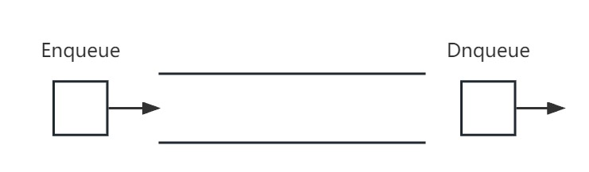</div>

<br>

---

## 数组实现队列

[循环数组实现队列C++完整示例](../data_structure/3-Queue_CircularArray.cpp)

```c
# define MAXSIZE 101

/*Creating a class named Queue.*/
class Queue
{
    private:
        int A[MAXSIZE];
        int front, rear;

    public:
        Queue()
        {
            front = -1;
            rear = -1;
        }

        bool IsEmpty()
        {
            return (front == -1 && rear == -1);
        }

        bool IsFull()
        {
            return (rear + 1) % MAXSIZE == front;
        }

        void Enqueue(int x)
        {
            if (IsEmpty())
                front = rear = 0;
            else if (IsFull())
            {
                cout << "Queue is full.\n";
                return;
            }
            else
            {
                rear = (rear + 1) % MAXSIZE;
            }
            A[rear] = x;
        }

        void Dequeue()
        {
            cout << "Dequeuing...\n";
            if (IsEmpty())
            {   cout << "Queue don't have element.\n";
                return;
            }
            else if (front == rear)
                front = rear = -1;
            else
                front = (front + 1) % MAXSIZE;
            cout << "Dequeue Complete.\n";
        }

        int Front()
        {
            if (front == -1)
            {
                cout << "Can't return front from empty queue.\n";
                return -1;
            }
            return A[front];
        }

        void Print()
        {
            if (IsEmpty())
                return;
            int count = (rear + MAXSIZE - front) % MAXSIZE + 1;
            cout << "\nQueue: ";
            for (int i = 0; i < count; i++)
            {
                int index = (front + i) % MAXSIZE;
                cout << A[index] << ' ';
            }
            cout << "\n";
        }
};
```

- 当头(`front`) 和 尾(`rear`) 都为-1时表示空队列
- **循环数组**节省使用内存

<div align="center">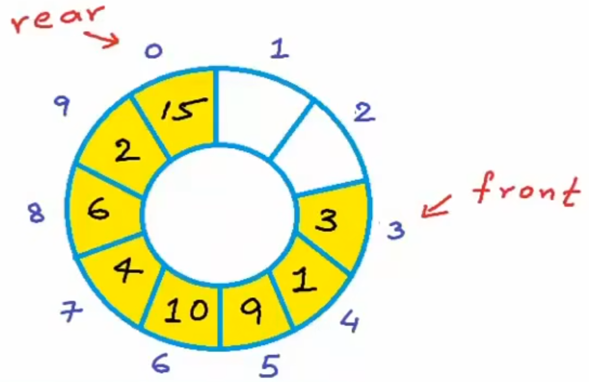</div>

**循环数组：**

- 当前位置：    `current % MAXSIZE`
- 下一个位置：`(current + 1) % MAXSIZE`
- 上一个位置：`(currect  + MAXSIZE - 1) % MAXSIZE`

<br>

---

## 链表实现队列

[单链表实现队列C++完整示例](../data_structure/3-QueueLinkList.c)

```c
void Enqueue(int x) {
    Node *temp = (Node *)malloc(sizeof(Node));
    temp->data = x;
    temp->next = NULL;
    if (IsEmpty())
    {
        front = rear = temp;
        return;
    }
    rear->next = temp;
    rear = temp;
}

int Dequeue() {
    Node *head1 = front;
    if (IsEmpty())
    {
        printf("Queue is empty.\n");
        return -1;
    }
    if (front == rear)
        front = rear = NULL;
    else
    {
        front = front->next;
    }
    free(head1);

    return front->data;
}
```

<br>

---

# 树

## 树的基本概念

**定义:**

- 树是n（n>=0）个结点的有限集。**当n = 0时，称为空树**。

- 非空树有且仅有一个特定的称为**根**的结点。

- 当n>1时，其余节点可分为m（m>0）个互不相交的有限集T1,T2,…,Tm，其中每个集合本身又是一棵树，并且称为根的子树。

> 显然，树的定义是递归的，即在树的定义中又用到了自身，树是一种递归的数据结构。树作为一种逻辑结构，同时也是一种分层结构。

<div align="center">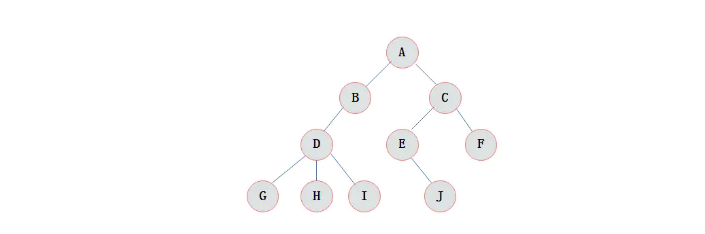</div>

1. **祖先:** 根A到结点H的唯一路径上的任意结点,称为结点K的**祖先**。H的祖先有D、B、A。

2. **双亲:** 从根到该节点的唯一路径上最靠近该节点的节点称为**双亲**。**根A**是树中唯一**没有双亲**的结点。H的双亲是D

3. **孩子:** G，H，I为D的孩子

4. **兄弟:** 有相同双亲的结点称为**兄弟**。B、C是兄弟

5. **节点的度:** 树中一个结点的孩子个数称为该**结点的度**，C的度为2， D的度为3

6. **树的度:** 一棵树中最大的结点度数

  > 度大于0的结点称为**分支结点**
  >
  > **叶子节点:** 度为0(没有子女结点)的结点称为**叶子结点**

7. **结点的深度:** 根节点到某节点的边的数目即为**深度**。根A节点深度为0，D的深度**为2**

8. **结点的高度:** 某节点到叶子节点的最长的边的数目称为**高度**。 C的高度为2， A的高度为3

9. **树的高度:** **根节点**的高度即为**树的高度**。上图树的高度为3

10. **节点层次:** 从根开始定义起，根为第一层，根的孩子为第二层，以此类推。

<br>

---

## 二叉树

定义：一个节点**最多**不能超过2个孩子的树


- **严格二叉树:** 树中除了叶子节点，每个节点都有两个子节点

<div align="center">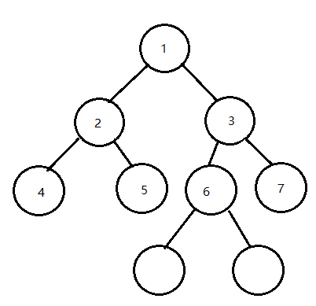</div>

​	

- **完全二叉树:** 除了最后一层之外的其它层都被完全填充，并且所有节点都向左对齐

<div align="center"></div>

- **完美二叉树/满二叉树:** 满足完全二叉树性质，树的叶子节点均在最后一层（也就是形成了一个完美的三角形）

<div align="center"></div>

- **平衡二叉树:** 对于每一个节点，它的左子树和右子树之间的**高度**不大于k（k通常为1），空树的高度为-1

<br>

---

**二叉树的计算：**

**操作树的成本一般取决于树的高度**。因此通常希望数的高度尽量小，即尽量平衡 (**平衡二叉树**)。

n个节点的**完全二叉树**，最小高度是$\log_2n$。$n$个节点的树，最大高度是$n-1$，对应的时间复杂度为$O(h) = O(\log_2n)$ 和$O(n)$

- 对于一颗高度为h的二叉树。最大节点数量: $n = 2^{h+1} - 1 = 2 ^{层次} - 1$ ，所以 $h = \log_2{(n + 1)} - 1 = \log_2{n}(向下取整)$

<br>

---

## 二叉树的高度

```c
#define max(a,b) (((a) > (b)) ? (a) : (b))

int FindHeight(BSTNode *root) 
{
    if (root == NULL)
        return -1;
    return max(FindHeight(root->left), FindHeight(root->right)) + 1;
}
```

- 叶子节点的时候，高度应该为0，最后返回`root`节点的高度

<br>

---

## 二叉树的遍历

**广度优先：**

- **横向先遍历，即按层次遍历。**从根节点往下，对每一层依此访问，在每一层中从左到右（也可以从右到左）遍历，遍历完一层就进入下一层，直到没有节点。

**深度优先：**

- **前序遍历:**  根节点--->左子节点--->右子节点（根节点在最**前面**被访问）

- **中序遍历:**  左子节点--->根节点--->右子节点（根节点在最**中间**被访问）

- **后续遍历:**  左子节点--->右子节点--->根节点（根节点在最**后面**被访问）

<div align="center">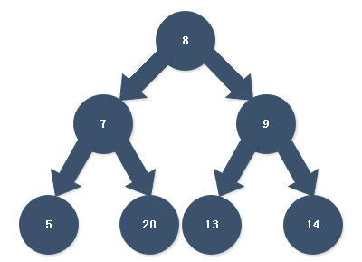</div>

对于上图二叉树的三种遍历顺序：

- 前序遍历：8、7、5、20、9、13、14
- 中序遍历：5、7、20、8、13、9、14
- 后续遍历：5、20、7、13、14、9、8

<br>

---

### 广度层次遍历

[广度遍历完整C++代码](../data_structure/4-LevelRoder.cpp)

```c++
string LevelOrder(Node* root) {
        string str = "";
        if (root == NULL)
            return str;

        queue<Node*> Q;     // The queue stores the data address to be retrieved
        Q.push(root);		// Start entering the root node

        while (!Q.empty()) {
            Node* temp = Q.front();
            str += temp->data;
            str += " ";
            if (temp->left != NULL) Q.push(temp->left);
            if (temp->right != NULL) Q.push(temp->right);
            Q.pop();
        }
        return str;
    }
```

**时间复杂度：**

- 与数据量成正比，$O(n)$

**空间复杂度：**

- `best`:  当只有一串左子树或右子树时， 为 $O(1)$；
- `worst`:  当为完美二叉树时， 近似为$O(\frac {n} {2})$,也就是 $O(n)$;
- `avg`:  $O(n)$

<div align="center">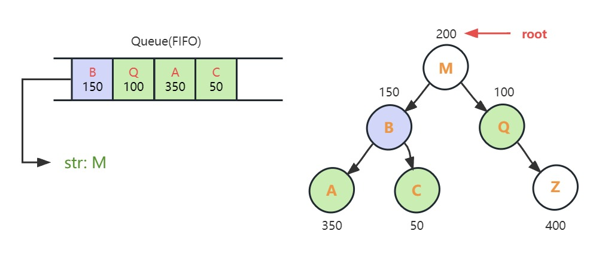</div>

<div align="center">广度层次遍历示意图</div>

<br>

---

### 深度层次遍历

```c
/*前序遍历*/
void Preorder(Node *root) 
{
    if (root == NULL)
        return;
    printf("%d ", root->data);
    Preorder(root->left);
    Preorder(root->right);
}

/*中序遍历*/
void Inorder(Node *root) 
{
    if (root == NULL)
        return;
    Inorder(root->left);
    printf("%d ", root->data);
    Inorder(root->right);
}

/*后序遍历*/
void Postorder(Node *root) 
{
    if (root == NULL)
        return;
    Postorder(root->left);
    Postorder(root->right);
    printf("%d ", root->data);
}
```

**时间复杂度：**$O(n)$

**空间复杂度：**

- `worst`:  $O(n)$
- `best/avg`:   $O(\log_2 n)$

<br>


---

## 二叉搜索树

**定义:** 任何节点的值一定大于其左子树中的每一个节点的键值，并小于其右子树的每一个节点的键值。

<br>

**平衡二叉搜索树**使用二分法查找元素复杂度为$O(\log _2n)$

- 计算方法: 假设遍历k次，$ {n}/{2 ^ k} = 1$,      则$k = \log _2 n$

**非平衡二叉搜索树**使用二分法查找元素复杂度为$O(n)$

<div align="center">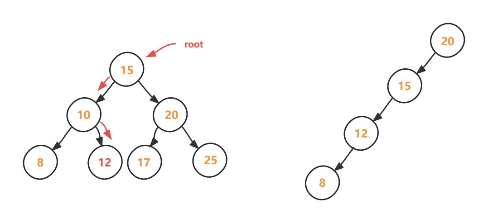</div>


<div align="center">平衡二叉搜索树和非平衡二叉搜索树复杂度对比</div>

<br>

---

### 链表实现二叉搜索树

[实现二叉搜索树C完整代码示例](../data_structure/4-BST.c)

[代码分析视频](https://www.bilibili.com/video/BV1Fv4y1f7T1?p=29&vd_source=cb747e9ce5eec653e35e42849c7a811b)

1. **二叉搜索树的插入和搜索**

```c
typedef struct BSTNode
{
    int data;
    struct BSTNode *left;
    struct BSTNode *right;
} BSTNode;

/*Function to create a new Node in heap.*/
BSTNode* GetNewNode(int data) 
{
    BSTNode *temp = (BSTNode *)malloc(sizeof(BSTNode));
    temp->data = data;
    temp->left = NULL;
    temp->right = NULL;
    return temp;
}

/*To insert data in BST, returns address of root node */
BSTNode* Insert(BSTNode *root, int data) 
{
    if (root == NULL) {
        root = GetNewNode(data);
    }
    else if (data <= root->data) {
        root->left = Insert(root->left, data);
    }
    else {
        root->right = Insert(root->right, data);
    }
    return root;
}

/*To search an element in BST, returns true if element is found.*/
char Search(BSTNode *root, int data)
{
    if (root == NULL)
        return 0;
    else if (data == root->data)
        return 1;
    else if (data < root->data) {
        return Search(root->left, data);
    }
    else {
        return Search(root->right, data);
    }
}
```

<div align="center">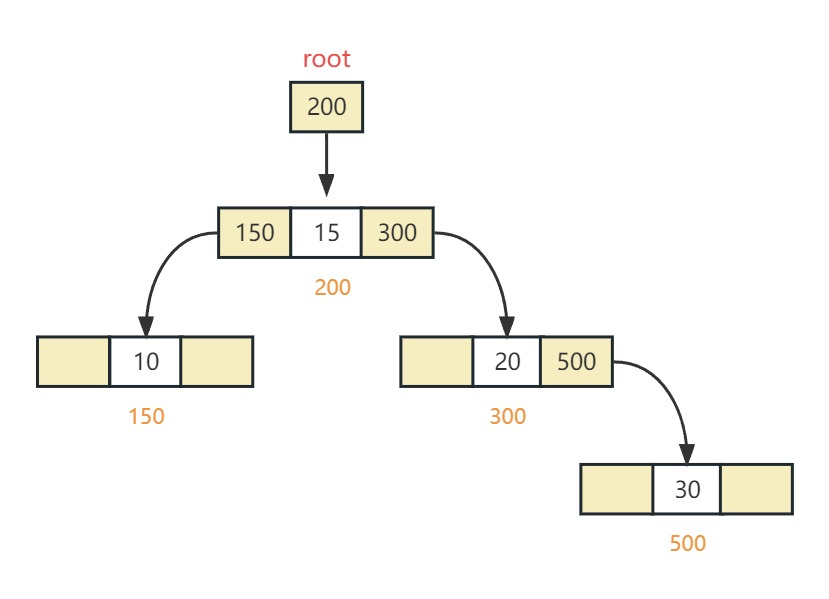</div>

<div align="center">链表实现二叉搜索树结构示意图</div>

<br>

2. **二叉搜索树的最大值和最小值**

```c
int FindMin(BSTNode *root) 
{
    if (root == NULL) {
        return -1;
    }
    else if (root->left == NULL) {
        return root->data;
    }
    return FindMin(root->left);
}
```

- 最大值同理

<br>

### 判断二叉搜索树

1. **根据值的范围判断**

```c
char IsBinarySearchTree(Node *root, int minValue, int maxValue) {
    if (root == NULL) {
        return 1;
    }

    if (root->data > minValue && root->data < maxValue
        && IsBinarySearchTree(root->left, minValue, root->data)
        && IsBinarySearchTree(root->right, root->data, maxValue))
        return 1;
    else {
        return 0;
    }
}
```

2. **中序遍历判断**

```C
bool isBST(struct Node* root, int* prev) {	// 需要给定一个非常小的prev
    if (root == NULL) {
        return true;
    }

    if (!isBST(root->left, prev)) {
        return false;
    }

    if (root->val <= *prev) {
        return false;
    }

    *prev = root->val;

    return isBST(root->right, prev);
}
```

<br>

---

### 二叉搜索树删除节点

[二叉搜索树删除节点完整C代码](../data_structure/4-BSTDeletion.c)

[代码分析视频](https://www.bilibili.com/video/BV1Fv4y1f7T1/?p=36&spm_id_from=pageDriver&vd_source=cb747e9ce5eec653e35e42849c7a811b)

```c
/*Find minimum in a tree.*/
Node* FindMin(Node *root) {
    while (root->left != NULL) {
        root = root->left;
    }
    return root;
}

/*Delete a Node in BST. */
Node* Delete(Node *root, int data) {
    if (root == NULL)
        return root;

    if (data < root->data) {
        root->left = Delete(root->left, data);
    }
    else if (data > root->data) {
        root->right = Delete(root->right, data);
    }
    else {
        if (root->left == NULL && root->right == NULL) {
            free(root);
            root = NULL;
            return root;
        }

        else if (root->left == NULL) {
            Node *temp = root;
            root = root->right;
            free(temp);
            return root;
        }
        else if (root->right == NULL) {
            Node *temp = root;
            root = root->left;
            free(temp);
            return root;
        }
        else {
            Node *temp = FindMin(root->right);
            root->data = temp->data;
            root->right = Delete(root->right, temp->data);
            return root;
        }
    }
}

```

<br>

---

### 二叉搜索树中序后继节点

[二叉搜索树搜索中序后继节点完整C代码](../data_structure/4-BST_InorderSuccessor.c)

1. 节点有右子树:  **右子树的最左边节点**。对于BST，也就是右子树的最小值为后继节点
2. 节点没有右子树: 
	- 节点为父节点的左子树，则该节点的**父节点**为后继节点
	- 节点为父节点的右子树，则该节点的**祖父节点**为后继节点

```c
/*Find Inorder Successor in a BST*/
Node* Getsuccessor(Node *root, int data) { 
    Node *currect = Find(root, data);
    if (currect == NULL)
        return NULL;
    if (currect->right != NULL) {
        return FindMin(currect->right);
    }
    else {
        Node *successor = NULL;
        Node *ancestor = root;
        while (currect != ancestor) {   // The successor will only be the parent node or grandparent
            if (currect->data < ancestor->data) {
                successor = ancestor;
                ancestor = ancestor->left;
            }
            else {
                ancestor = ancestor->right;
            }
        }
        return successor;
    }
}

```

<br>

---

# 图

## 图的定义

图(Graph)是由顶点的有穷非空集合$V(G)$和顶点之间边的集合$E(G)$组成，通常表示为:$G = (V，E)$。其中，V是图G中顶点的集合，E是图中边的集合。

若$V = \{v_1, v_2, ... v_n\}$, 则用$|V|$表示图中顶点的个数，也称图的阶。

$E = \{(u, v) | u \in V, v \in V\}$ ， 用$|E|$ 表示图G边的条数。

> 注意:线性表可以是空表，树可以是空树，但图不可以是空图。就是说，图中不能一个顶点也没有，图的顶点集V一定非空，但边集E可以为空，此时图中只有顶点而没有边。

---

1. **有向图**

若E是有向边(也称弧)的有限集合时，则图G为有向图。弧是顶点的有序对，记为<v, w>，其中v,w是顶点，v称为弧尾，w称为弧头，<v,w>称为从顶点v到顶点w的弧，也称v邻接到w，或w邻接自v。

<div align="center">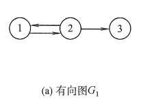</div>

图(a)所示的有向图$G_1$可表示为:
$$
G_1 = (V_1, E_1)	\\
V_1 = \{1, 2, 3\}	\\
E_1 = \{<1, 2>, <2, 1>, <2, 3> \}
$$


